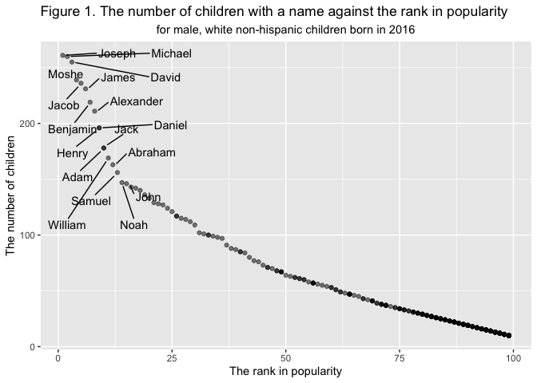

P8105\_hw2\_gl2677
================
Gaotong LIU
9/26/2019

## Problem 1

#### Read and clean the Mr. Trash Wheel sheet

``` r
mr_trash_wheel = 
  read_excel("./data/Trash-Wheel-Collection-Totals-8-6-19.xlsx",
             sheet = "Mr. Trash Wheel",
             range = "A2:N408") %>% 
  janitor::clean_names() %>%
  drop_na(dumpster) %>% 
  mutate(sports_balls = round(sports_balls, digits = 0),
         sports_balls = as.integer(sports_balls)) 
```

#### Read and clean precipitation data for 2017 and 2018

``` r
prec_2017 = 
    read_excel("./data/Trash-Wheel-Collection-Totals-8-6-19.xlsx",
             sheet = "2017 Precipitation",
             range = "A2:B14") %>% 
  janitor::clean_names() %>%
  mutate(year = "2017",
         month = month.name) %>% 
  drop_na() 

prec_2018 = 
    read_excel("./data/Trash-Wheel-Collection-Totals-8-6-19.xlsx",
             sheet = "2018 Precipitation",
             range = "A2:B14") %>% 
  janitor::clean_names() %>% 
  mutate(year = "2018",
         month = month.name) %>% 
  drop_na() 

#Join 2017 and 2018 percipitation
prec_2017_2018 = bind_rows(prec_2017 , prec_2018) 
```

#### Interpretation

There are 344 observations and 14 variables in `mr_trash_wheel` dataset.
This dataset has the information on the dumpter number, date of
collection, amount of total litter (weight and volume), litter type and
the number of homes powered by trash. In my opinion, the amount of total
litter, litter type and homes powered are most important for further
research. The key variables for further research are `weight_tons,
volume_cubic_yards, plastic_bottles, polystyrene, cigarette_butts,
glass_bottles, grocery_bags, chip_bags, sports_balls, homes_powered`.
The median number of sports balls in a dumpster in 2017 was 8.

There are 24 observations and 3 variables in `prec_2017_2018` dataset.
This dataset shows the total precipitation in the corresponding month
and year. The key variables for further research are `total`, and I use
`year` and `month` as the key to tidy the dataset. The total
precipitation in 2018 was 70.33.

## Problem 2

#### Read and clean pols\_month data

``` r
pols_month = 
  read_csv("./data/pols-month.csv") %>% 
  separate(mon, into = c("year","month","day"), sep = "-") %>% 
  mutate(year = as.numeric(year),
         month = as.numeric(month),
         month = month.name[month],
         president = factor(prez_dem, 
                            levels = c("gop"  = 0, "dem" = 1),
                            labels = c("gop","dem"))) %>% 
  select(-day, -prez_gop, -prez_dem)
```

#### Read and clean snp data

``` r
snp = 
  read_csv("./data/snp.csv") %>% 
  separate(date, into = c("month","day","year"), sep = "/") %>% 
  mutate(year = as.numeric(year),
         month = as.numeric(month)) %>% 
    arrange(year,month) %>% 
  mutate(month = month.name[month]) %>% 
  select(year,month,close)
```

#### Read and clean unemployment data

``` r
unemployment = 
  read_csv("./data/unemployment.csv") %>% 
  pivot_longer(Jan:Dec,
               names_to = "month",
               values_to = "percentage") %>% 
  rename(year = Year) %>% 
  mutate(month = match(month, month.abb),
         month = month.name[month])

pols_snp = left_join(pols_month, snp, by = c("year","month")) 
pols_snp_unemp = left_join(pols_snp, unemployment, by = c("year","month"))
```

#### Interpretation

There are 822 observations and 9 variables in `pols_month` dataset. This
dataset shows the president’s political party and the number of national
politicians who are democratic or republican at any given time. The key
variables for further research are `gov_gop, sen_gop, rep_gop, gov_dem,
sen_dem, rep_dem, president`. The range of year is from 1947 to 2015.

There are 787 observations and 3 variables in `snp` dataset. This
dataset is related to Standard & Poor’s stock market index (S\&P) at any
given time. The key variables for research are `close`. The range of
year is from 1950 to 2015.

There are 816 observations and 3 variables in `unemployment` dataset.
This dataset shows unemployment percentage at any given time. The key
variables for further research are `percentage`. The range of year is
from 1948 to 2015.

There are 822 observations and 11 variables in `pols_snp_unemp`
**resulting dataset**. The key variables for further research are
`gov_gop, sen_gop, rep_gop, gov_dem, sen_dem, rep_dem, president, close,
percentage`, and I use `year` and `month` as the key to tidy the
dataset. The range of year is from 1947 to 2015.

## Problem 3

#### Read and clean baby\_names data

``` r
baby_names = 
  read_csv("./data/Popular_Baby_Names.csv") %>% 
  janitor::clean_names() %>% 
  mutate(gender = str_to_lower(gender),
         ethnicity = str_to_lower(ethnicity),
         childs_first_name = str_to_lower(childs_first_name),
         ethnicity = recode(ethnicity, `asian and paci` = "asian and pacific islander", `black non hisp` = "black non hispanic", `white non hisp` = "white non hispanic")) %>% 
  distinct() 
```

#### Rank of olivia over time

``` r
folivia = baby_names %>% 
  filter(childs_first_name == "olivia" & gender == "female") %>% 
  select(-childs_first_name, -gender, -count) %>% 
  pivot_wider(names_from = "year_of_birth",
              values_from = "rank") %>% 
  knitr::kable(caption = "Table 1. The rank in popularity of the name “Olivia” as a female baby name over time.")
folivia
```

| ethnicity                  | 2016 | 2015 | 2014 | 2013 | 2012 | 2011 |
| :------------------------- | ---: | ---: | ---: | ---: | ---: | ---: |
| asian and pacific islander |    1 |    1 |    1 |    3 |    3 |    4 |
| black non hispanic         |    8 |    4 |    8 |    6 |    8 |   10 |
| hispanic                   |   13 |   16 |   16 |   22 |   22 |   18 |
| white non hispanic         |    1 |    1 |    1 |    1 |    4 |    2 |

Table 1. The rank in popularity of the name “Olivia” as a female baby
name over time.

#### Name of rank first over time

``` r
mrank = baby_names %>% 
  filter(rank == 1 & gender == "male") %>% 
  select(-rank, -gender, -count) %>% 
  mutate(childs_first_name = str_to_title(childs_first_name)) %>% 
  pivot_wider(names_from = "year_of_birth",
              values_from = "childs_first_name") %>% 
  knitr::kable(caption = "Table 2. The most popular name among male children over time.")
mrank
```

| ethnicity                  | 2016   | 2015   | 2014   | 2013   | 2012   | 2011    |
| :------------------------- | :----- | :----- | :----- | :----- | :----- | :------ |
| asian and pacific islander | Ethan  | Jayden | Jayden | Jayden | Ryan   | Ethan   |
| black non hispanic         | Noah   | Noah   | Ethan  | Ethan  | Jayden | Jayden  |
| hispanic                   | Liam   | Liam   | Liam   | Jayden | Jayden | Jayden  |
| white non hispanic         | Joseph | David  | Joseph | David  | Joseph | Michael |

Table 2. The most popular name among male children over time.

#### Scatterplot

``` r
baby_names %>% 
  filter(gender == "male" & ethnicity == "white non hispanic" & year_of_birth == "2016") %>% 
  mutate(childs_first_name = str_to_title(childs_first_name)) %>% 
  ggplot(aes(x = rank, y = count)) +
  geom_point(alpha = 0.5) + 
  geom_text_repel(aes(label = ifelse(rank <= 15, as.character(childs_first_name),'')),
                  box.padding   = 0.5,
                  point.padding = 0.5) +
  labs(title = "Figure 1. The number of children with a name against the rank in popularity ", 
       x = "The rank in popularity",
       y = "The number of children",
       subtitle = "for male, white non-hispanic children born in 2016") +
  theme(plot.subtitle = element_text(hjust = 0.5))
```

<!-- -->
